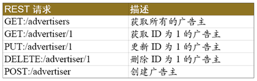

SOAP是一种具体的通讯协议,REST是一种规范.

1. SOAP(Simple Object Access Protocol)简单对象访问协议，是基于HTTP的一种异构系统通信的协议，说白了就是xml文档传输，之所以会有它，就是在于不同语言C,C++,JAVA等语言开发的系统进行通信，是WebService就是基于SOAP协议的，确实是一种比较传统的SOA解决方案。  
2. REST(Rerepresentational State Transfer)是外国一位博士提出的一种架构风格，从资源状态转换角度看待我们的资源(如此简洁，明了)，所以SOAP是一种协议而Rest只是一种大家约定的规范,所以更加轻便,在spring约定大于配置的框架下更容易被人接受

WebService平台技术

SOAP、WSDL（WebServicesDescriptionLanguage）、UDDI（UniversalDescriptionDiscovery andIntegration）三者构成了WebService的三要素

- SOAP

WebService通过HTTP协议发送请求和接收结果时，发送的请求内容和结果内容都采用XML格式封装，并增加了一些特定的HTTP消息头，以说明HTTP消息的内容格式，这些特定的HTTP消息头和XML内容格式就是SOAP协议。SOAP提供了标准的RPC方法来调用Web Service。

SOAP协议组成：

SOAP协议 = HTTP协议 + XML数据格式

SOAP协议定义了SOAP消息的格式，SOAP协议是基于HTTP协议的，SOAP也是基于XML和XSD的，XML是SOAP的数据编码方式。打个比喻：HTTP就是普通公路，XML就是中间的绿色隔离带和两边的防护栏，SOAP就是普通公路经过加隔离带和防护栏改造过的高速公路。

- WSDL

好比我们去商店买东西，首先要知道商店里有什么东西可买，然后再来购买，商家的做法就是张贴广告海报。 WebService也一样，WebService客户端要调用一个WebService服务，首先要有知道这个服务的地址在哪，以及这个服务里有什么方法可以调用，所以，WebService务器端首先要通过一个WSDL文件来说明自己家里有啥服务可以对外调用，服务是什么（服务中有哪些方法，方法接受的参数是什么，返回值是什么），服务的网络地址用哪个url地址表示，服务通过什么方式来调用。

WSDL(Web Services Description Language)就是这样一个基于XML的语言，用于描述Web Service及其函数、参数和返回值。它是WebService客户端和服务器端都能理解的标准格式。因为是基于XML的，所以WSDL既是机器可阅读的，又是人可阅读的，这将是一个很大的好处。一些最新的开发工具既能根据你的Web service生成WSDL文档，又能导入WSDL文档，生成调用相应WebService的代理类代码。

- UDDI

UDDI (Universal Description, Discovery, and Integration) 是一个主要针对Web服务供应商和使用者的新项目。在用户能够调用Web服务之前，必须确定这个服务内包含哪些商务方法，找到被调用的接口定义，还要在服务端来编制软件，UDDI是一种根据描述文档来引导系统查找相应服务的机制。UDDI利用SOAP消息机制（标准的XML/HTTP）来发布，编辑，浏览以及查找注册信息。它采用XML格式来封装各种不同类型的数据，并且发送到注册中心或者由注册中心来返回需要的数据。

Rest

REST本质上是使用URL来访问资源种方式。众所周知，URL就是我们平常使用的请求地址了，其中包括两部分：请求方式与请求路径，比较常见的请求方式是GET与POST，但在REST中又提出了几种其它类型的请求方式，汇总起来有六种：GET、POST、PUT、DELETE、HEAD、OPTIONS。尤其是前四种，正好与CRUD（Create-Retrieve-Update-Delete，增删改查）四种操作相对应，例如，GET（查）、POST（增）、PUT（改）、DELETE（删），这正是REST与CRUD的异曲同工之妙！需要强调的是，REST是“面向资源”的，这里提到的资源，实际上就是我们常说的领域对象，在系统设计过程中，我们经常通过领域对象来进行数据建模。

REST是一个“无状态”的架构模式，因为在任何时候都可以由客户端发出请求到服务端，最终返回自己想要的数据，当前请求不会受到上次请求的影响。也就是说，服务端将内部资源发布REST服务，客户端通过URL来访问这些资源，这不就是SOA所提倡的“面向服务”的思想吗？所以，REST也被人们看做是一种“轻量级”的SOA实现技术，因此在企业级应用与互联网应用中都得到了广泛应用。

下面我们举几个例子对REST请求进行简单描述：

可见，请求路径相同，但请求方式不同，所代表的业务操作也不同，例如，/advertiser/1这个请求，带有GET、PUT、DELETE三种不同的请求方式，对应三种不同的业务操作。