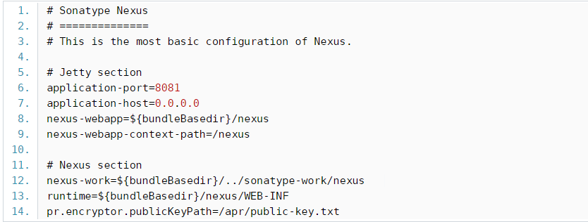
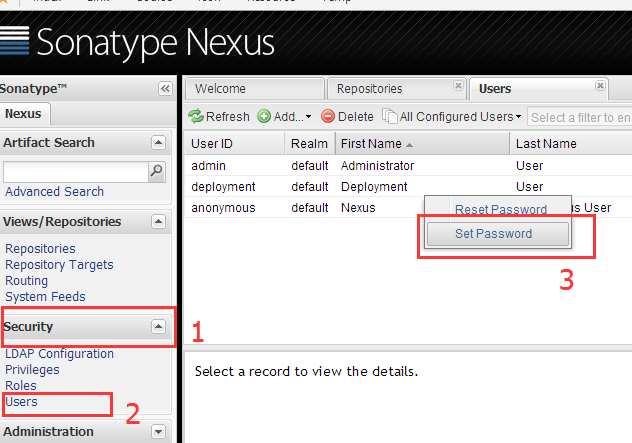
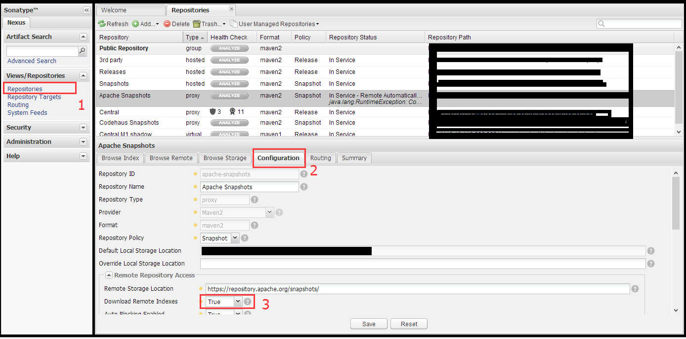
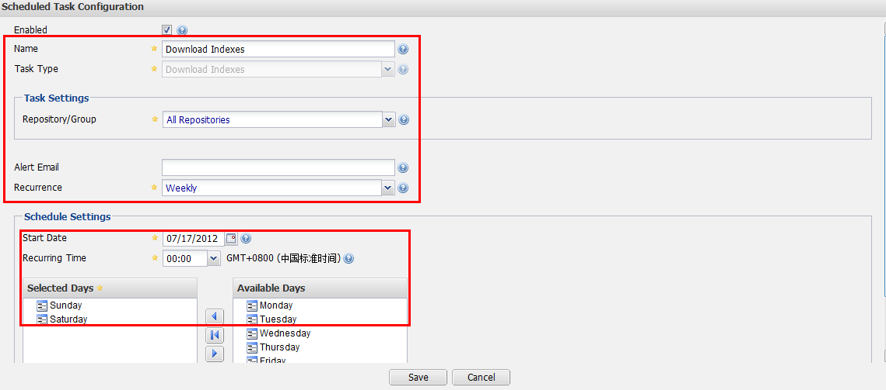
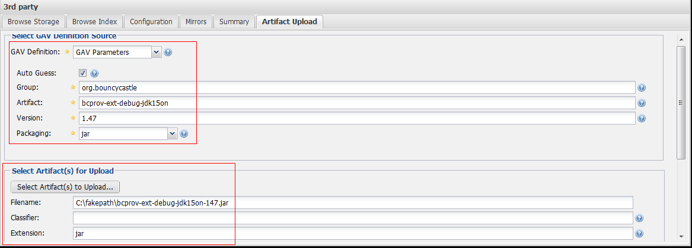
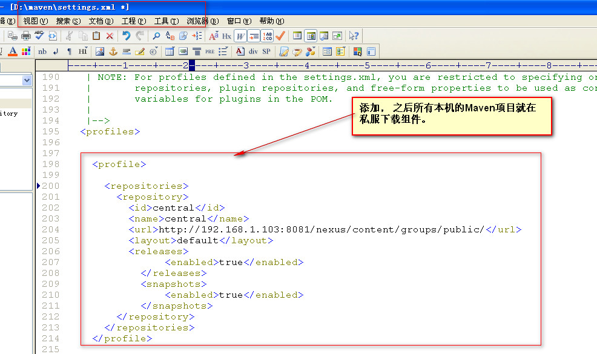
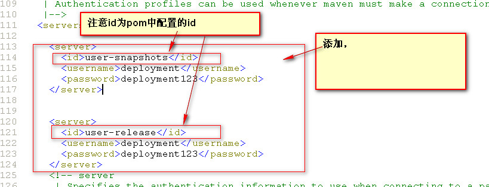
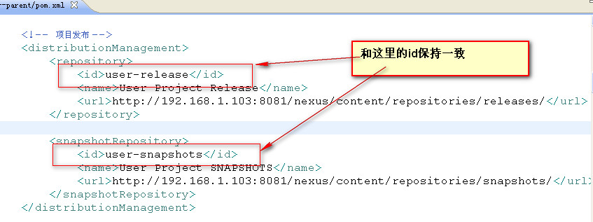

1. 下载nexus解压:

   ```shell
   wget  http://www.sonatype.org/downloads/nexus-latest-bundle.tar.gz
   
   tar zxvf nexus-2.11.3-01-bundle.tar.gz
   ```

2. 进入bin 运行nexus

```shell
cd nexus-2.11.3-01/bin

启动:./nexus start

停止:./nexus stop
```


> 这时候提示：
>
> ****************************************
>
> WARNING – NOT RECOMMENDED TO RUN AS ROOT
>
> ****************************************
>
> If you insist running as root, then set the environment variable RUN_AS_USER=root before running this script.


大概意思就是要在环境配置export RUN_AS_USER=root，临时配置

在命令行下输入：

```she
export RUN_AS_USER=root
```

然后执行，就不会再提示了

```she
./nexus start
```

也可以在系统里面永久配置

```shell
vi /etc/profile  加入export RUN_AS_USER=root
```


端口配置在nexus/conf/nexus.properties文件中，文件如下：



> 有可能还需要打开端口:vim /etc/sysconfig/iptables

>  增加一行:-A INPUT -p tcp -m state --state NEW -m tcp --dport 8081-j ACCEPT

> 重启防火墙:systemctl restart iptables.service

3. nexus配置

   > 用户名:admin
   >
   > 密码:admin123

   - 修改密码:

   

   - 将所有type为proxy的configuration配置选项中DownloadRemoteIndex置为True，然后点击Save保存 

     

   - 定制任务 

     当然，为了让你的nexus更加智能，需要做一些定时任务，譬如定期下载索引，加快本地mvn检索速度。 

     以建立定期下载索引为例，在Administration选项中找到Scheduled Tasks，在窗口页面点击Add，进行配置：

     

   - 添加第三方JAR

     除此之外，我还经常要添加一些额外的jar到nexus中，譬如我要追加BC的组件包到nexus中，供团队其他开发成员使用。 

     找到View/Repositories,打开Repositories窗口，选择3rd party，进行如下配置：

     

----------------------

一般用到的仓库种类是hosted、proxy。Hosted代表宿主仓库，用来发布一些第三方不允许的组件，比如[Oracle](http://lib.csdn.net/base/oracle)驱动、比如商业软件jar包。Proxy代表代理远程的仓库，最典型的就是Maven官方中央仓库、JBoss仓库等等。如果构建的Maven项目本地仓库没有依赖包，那么就会去这个代理站点去下载，那么如果代理站点也没有此依赖包，就回去远程中央仓库下载依赖，这些中央仓库就是proxy。代理站点下载成功后再下载至本机。


- hosted   类型的仓库，内部项目的发布仓库

- releases 内部的模块中release模块的发布仓库

- snapshots 发布内部的SNAPSHOT模块的仓库

- 3rd party 第三方依赖的仓库，这个数据通常是由内部人员自行下载之后发布上去

- proxy   类型的仓库，从远程中央仓库中寻找数据的仓库

- group   类型的仓库，组仓库用来方便我们开发人员进行设置的仓库

-------------------------

指定maven私有仓库有两种方式 : 

- **第一种是在项目的pom.xml中指定私有仓库地址**

```xml
<repositories>  
        <repository>  
            <id>nexus</id>  
            <name>nexus</name>  
            <url>http://<你的仓库ip>:8081/nexus/content/groups/public/</url>  
            <releases>  
                <enabled>true</enabled>  
            </releases>  
            <snapshots>  
                <enabled>true</enabled>  
            </snapshots>  
        </repository>  
    </repositories> 
<!-- 插件仓库 -->
<pluginRepositories>  
        <pluginRepository>  
            <id>nexus</id>  
            <name>nexus</name>  
            <url>http://<你的仓库ip>:8081/nexus/content/groups/public/</url>  
            <releases>  
                <enabled>true</enabled>  
            </releases>  
            <snapshots>  
                <enabled>true</enabled>  
            </snapshots>  
        </pluginRepository>  
 </pluginRepositories> 
```

- **第二种是指定全局的仓库地址,这样所有的项目都可以从这个仓库下载**

  修改maven的setting.xml文件

  

追加激活profile:

```xml
1. <activeProfiles>  
2.     <activeProfile>central</activeProfile>          
3. </activeProfiles>
```

profile作用:

profile可以让我们定义一系列的配置信息，然后指定其激活条件。这样我们就可以定义多个profile，然后每个profile对应不同的激活条件和配置信息，从而达到不同环境使用不同配置信息的效果


------------------------------

项目发布到maven库:

```xml
<distributionManagement>  
   <repository>  
      <id>user-release</id>  
      <name>User Project Release</name>  
      <url>http://192.168.1.103:8081/nexus/content/repositories/releases/</url>  
    </repository>  

    <snapshotRepository>  
      <id>user-snapshots</id>  
      <name>User Project SNAPSHOTS</name>  
      <url>http://192.168.1.103:8081/nexus/content/repositories/snapshots/</url>  
    </snapshotRepository>  
</distributionManagement>
```

*注意配置了还是发布项目到私服失败，原因为没有权限*

配置权限在settings.xml





然后运行发布  clean deploy