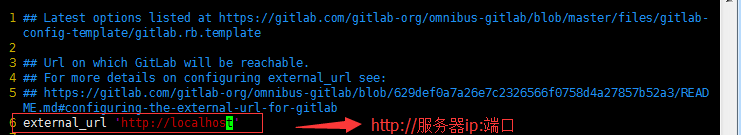

1. **安装相关依赖**

   ```shell
   > yum -y install policycoreutils openssh-server openssh-clients postfix
   ```

2. **启动postfix，并设置开机启动**

   ```shell
   > systemctl enable postfix&& systemctl start postfix
   ```

   *目的:支持gitlab邮件发送*

3. **下载gitLab安装包**

   centos 7系统的下载地址:https://mirrors.tuna.tsinghua.edu.cn/gitlab-ce/yum/el7

   下载rpm包并安装:

   ```shell
   > wget https://mirrors.tuna.tsinghua.edu.cn/gitlab-ce/yum/el7/gitlab-ce-8.0.0-ce.0.el7.x86_64.rpm
   > rpm -i 'gitlab-ce-8.0.0-ce.0.el7.x86_64.rpm'
   ```

4. **修改GitLab配置文件指定服务器IP和端口号**

   ```shell
   > vim /etc/gitlab/gitlab.rb
   ```

   

   退出并保存（：wq）

   *ps:注意这里设置的端口不能被占用，默认是8080端口，如果8080已经使用，请自定义其它端口，并在防火墙设置开放相对应得端口*

5. **重置并启动GitLab**

   ```shell
   > gitlab-ctl reconfigure
   > gitlab-ctl restart
   ```

   执行结果为：

   > ok: run: gitlab-git-http-server: (pid 3922) 1s
   >
   > ok: run: logrotate: (pid 3929) 0s
   >
   > ok: run: nginx: (pid 3936) 1s
   >
   > ok: run: postgresql: (pid 3941) 0s
   >
   > ok: run: redis: (pid 3950) 0s
   >
   > ok: run: sidekiq: (pid 3955) 0s
   >
   > ok: run: unicorn: (pid 3961) 1s

6. **访问 GitLab页面**

   如果没有域名，直接输入服务器ip和指定端口进行访问 

   初始账户: root 密码: 5iveL!fe

7. **设置gitlab发信功能，需要注意一点：**

   发信系统用的默认的postfix，smtp是默认开启的，两个都启用了，两个都不会工作。

   我这里设置关闭smtp，开启postfix

   关闭smtp方法：vim /etc/gitlab/gitlab.rb

   找到#gitlab_rails['smtp_enable'] = true 改为 gitlab_rails['smtp_enable'] = false

   修改后执行gitlab-ctl reconfigure

   另一种是关闭postfix，设置开启smtp，相关教程请参考官网https://doc.gitlab.cc/omnibus/settings/smtp.html


   ####  报错处理 :

   1. 登录502报错

   一般是权限问题，解决方法：chmod -R 755 /var/log/gitlab

   如果还不行，请检查你的内存，安装使用GitLab需要至少4GB可用内存(RAM + Swap)! 由于操作系统和其他正在运行的应用也会使用内存, 所以安装GitLab前一定要注意当前服务器至少有4GB的可用内存. 少于4GB内存会出现各种诡异的问题, 而且在使用过程中也经常会出现500错误.


   2. gitlab-ctl reconfigure

   报错n itdb: could not obtain information about current user: Permission denied

   Error executing action `run` on resource 'execute[/opt/gitlab/embedded/bin/initdb -D /var/opt/gitlab/postgresql/data -E UTF8]'

   根据报错信息大概锁定用户的权限问题,安装gitlab-ce会自动添加用户四个用户:

   gitlab-www​ :x:497:498::/var/opt/gitlab/nginx:/bin/false

   git:x:496:497::/var/opt/gitlab:/bin/sh

   gitlab-redis:x:495:496::/var/opt/gitlab/redis:/bin/nologin

   gitlab-psql:x:494:495::/var/opt/gitlab/postgresql:/bin/sh

   google和百度都搜索不到解决方法,既然出错提示到权限问题，那么按照这个方向去查就不会有问题，后来查了文件/etc/passwd的权限是600,给予644权限后,成功解决报错问题
