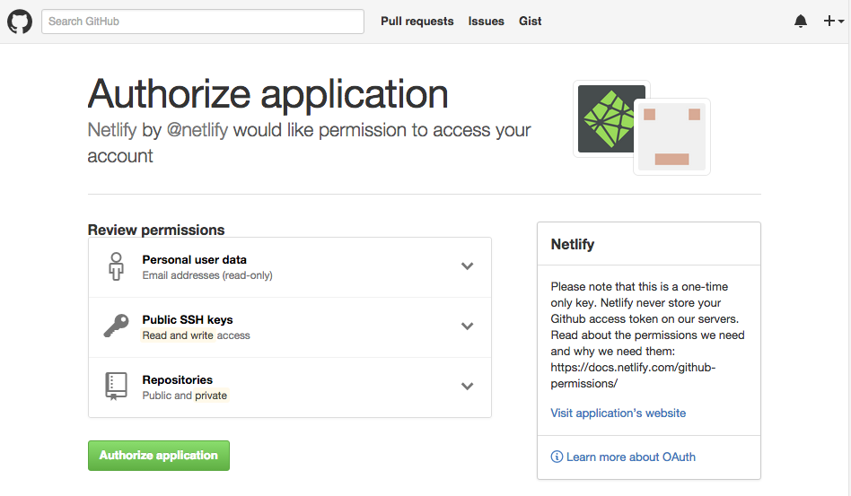
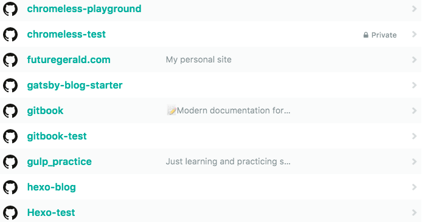
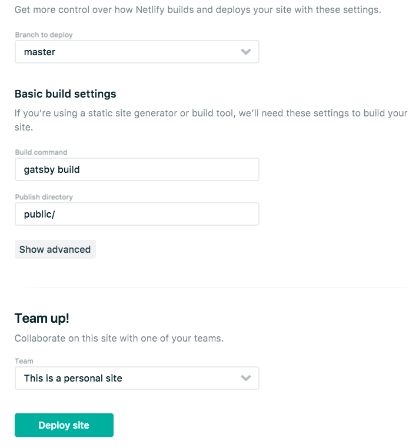
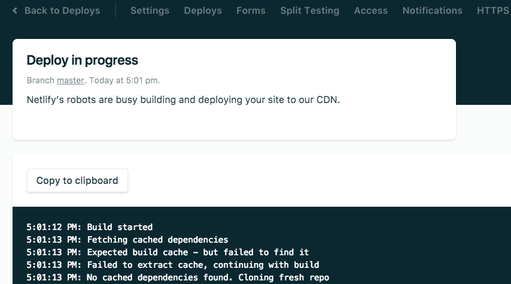

一、安装nodejs

​	自行安装，不懂百度

二、安装gatsby

​	官网：https://www.gatsbyjs.org/starters/

​	1.安装gatsby命令行工具

```shell
> npm install --global gatsby-cli
```

​	2.创建一个新地址

```shell
> gatsby new gatsby-site https://github.com/gatsbyjs/gatsby-starter-default
```

​	gatsby-site为项目名称，后面为要下载的模板地址，模板可参照上面地址下载

​	3.进去项目文件夹

```shell
> cd gatsby-site
```

​	4.启动项目

```shell
> gatsby develop
```

​	启动成功后默认地址为：localhost：8000

三、GitHub

​	1.github上创建一个新仓库

​		不懂百度

​	2.推送代码到github

​	进去本地项目目录

```shell
> git init
> git add .
> git commit -m 'init commit'
> git remote add origin [仓库地址]
> git push -u origin master
```


四、部署Netlify	

​	1.注册

​		不懂百度

​	2.添加仓库地址

​	

​	3.链接向你的项目地址

​	

​	3.验证Netlify



​	4.选择项目部署

​	

​	5.部署配置

​	

​	6.构建项目

​	

7.更改

​	每当你向github上的发布分支提交代码的时候，netlify会自动拉去代码构建发布。

-----------------------

#### focus

​	当你在两台电脑上构建gatsbyjs的时候，比如一台windows，一台mac。你可能会遇到无法本地启动的问题。很不幸，我踩到这个坑了，而且没有搜索到相关信息。

1.下载代码

​	你既可以选择用git下载，也可以用gatsby的命令下载

​	gatsby命令为：

```shell
> gatsby new [项目名] [github地址]
```

2.

​	本地删掉package-lock.json文件，在项目根目录，这个文件我理解为，本地编译所需要的dependency，包含版本信息，不同系统可以会有不同

​	进去项目根目录执行命令：

```shell
> npm install
```

​	你会看到在重新下载所需要的依赖包，并生成一份新的package-lock.json。这里应该是依据package.json文件生成的。然后启动项目，done。

------------

> 参考：https://www.netlify.com/blog/2016/02/24/a-step-by-step-guide-gatsby-on-netlify/