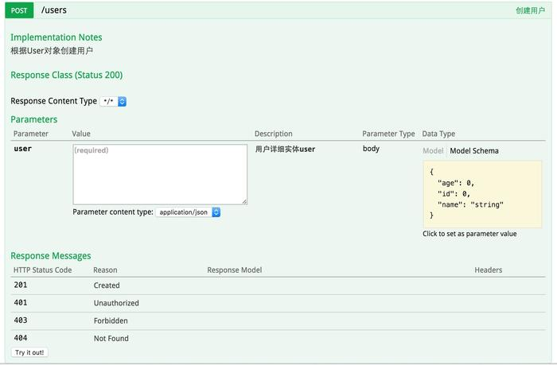

#### 一、swagger简介

```tex
swagger是一个功能强大的api框架，它的集成非常简单，不仅提供了在线文档的查阅，而且还提供了在线文档的测试。
使用Swagger2有助于我们编写一份详细的RESTful业务接口文档，过去经常会使用Word或者Excel，但是接口非常多，细节又复杂，如果由程序员高质量的输出一个文档，经常耗时长而且效果也不好。
Swagger2能将代码和注释说明很好结合在一块。既减轻了研发人员的负担，又能输出高质量的文档。
```

#### 二、swagger配置

	###### 1.引入依赖

```xml
<dependency>
    <groupId>io.springfox</groupId>
    <artifactId>springfox-swagger2</artifactId>
    <version>2.2.2</version>
</dependency>
<dependency>
    <groupId>io.springfox</groupId>
    <artifactId>springfox-swagger-ui</artifactId>
    <version>2.2.2</version>
</dependency>
```

##### 2.创建swagger2配置类

```java
@Configuration //让Spring来加载该类配置
@EnableSwagger2 //来启用Swagger2
public class Swagger2 {

    @Bean
    public Docket createRestApi() {
        return new Docket(DocumentationType.SWAGGER_2)
                .apiInfo(apiInfo())
                .select()
                .apis(RequestHandlerSelectors.basePackage("com.didispace.web"))
                .paths(PathSelectors.any())
                .build();
    }
/**
    1.select()函数返回一个ApiSelectorBuilder实例用来控制哪些接口暴露给Swagger来展现，采用指定扫描的包路径来定义，Swagger会扫描该包下所有Controller定义的API，并产生文档内容（除了被@ApiIgnore指定的请求）
    2.apis方法定义了扫描接口的包名
**/
    /*
        apiInfo()用来创建该Api的基本信息（这些基本信息会展现在文档页面中）
    */
    private ApiInfo apiInfo() {
        return new ApiInfoBuilder()
                .title("接口集合标题")
                .description("接口集合描述")
                //.termsOfServiceUrl("http://www.jianshu.com/u/f192766abeab")
                //.contact("作者名")
                .contact(new Contact("作者名",
                    "http://www.jianshu.com/u/f192766abeab",
                    "email地址"))
                .version("1.0")
                .build();
        }   
    }
```

##### 3.添加文档内容

###### **常用注解**

```
@Api：修饰整个类，描述Controller的作用
@ApiOperation：描述一个类的一个方法，或者说一个接口
@ApiParam：单个参数描述
@ApiModel：用对象来接收参数
@ApiProperty：用对象接收参数时，描述对象的一个字段
@ApiResponse：HTTP响应其中1个描述
@ApiResponses：HTTP响应整体描述
@ApiIgnore：使用该注解忽略这个API
@ApiError ：发生错误返回的信息
@ApiParamImplicitL：一个请求参数
@ApiParamsImplicit 多个请求参数
```

###### demo

```java
@RestController
@RequestMapping(value="/users")
public class UserController {

    static Map<Long, User> users = Collections.synchronizedMap(new HashMap<Long, User>());

    @ApiOperation(value="获取用户列表", notes="")
    @RequestMapping(value={""}, method=RequestMethod.GET)
    public List<User> getUserList() {
        List<User> r = new ArrayList<User>(users.values());
        return r;
    }

    @ApiOperation(value="创建用户", notes="根据User对象创建用户")
    @ApiImplicitParam(name = "user", value = "用户详细实体user", required = true, dataType = "User")
    @RequestMapping(value="", method=RequestMethod.POST)
    public String postUser(@RequestBody User user) {
        users.put(user.getId(), user);
        return "success";
    }

    @ApiOperation(value="获取用户详细信息", notes="根据url的id来获取用户详细信息")
    @ApiImplicitParam(name = "id", value = "用户ID", required = true, dataType = "Long")
    @RequestMapping(value="/{id}", method=RequestMethod.GET)
    public User getUser(@PathVariable Long id) {
        return users.get(id);
    }

    @ApiOperation(value="更新用户详细信息", notes="根据url的id来指定更新对象，并根据传过来的user信息来更新用户详细信息")
    @ApiImplicitParams({
            @ApiImplicitParam(name = "id", value = "用户ID", required = true, dataType = "Long"),
            @ApiImplicitParam(name = "user", value = "用户详细实体user", required = true, dataType = "User")
    })
    @RequestMapping(value="/{id}", method=RequestMethod.PUT)
    public String putUser(@PathVariable Long id, @RequestBody User user) {
        User u = users.get(id);
        u.setName(user.getName());
        u.setAge(user.getAge());
        users.put(id, u);
        return "success";
    }

    @ApiOperation(value="删除用户", notes="根据url的id来指定删除对象")
    @ApiImplicitParam(name = "id", value = "用户ID", required = true, dataType = "Long")
    @RequestMapping(value="/{id}", method=RequestMethod.DELETE)
    public String deleteUser(@PathVariable Long id) {
        users.remove(id);
        return "success";
    }

}
```

```
完成上述代码添加上，启动Spring Boot程序，访问：http://localhost:8080/swagger-ui.html,
就能看到前文所展示的RESTful API的页面。我们可以再点开具体的API请求，以POST类型的/users请求为例，可找到上述代码中我们配置的Notes信息以及参数user的描述信息，如下图所示。
```

